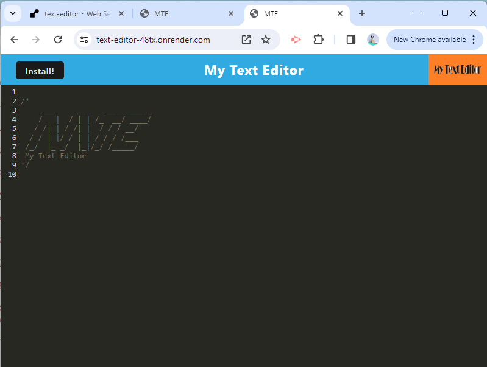
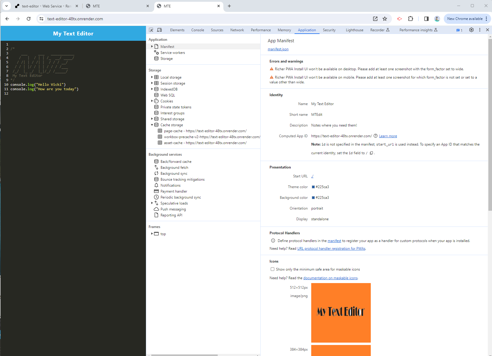
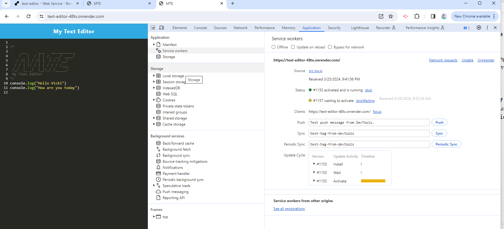
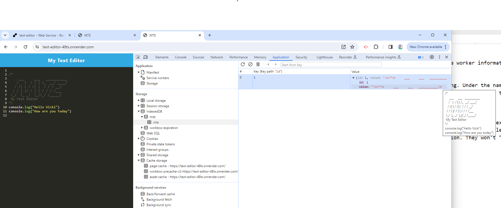
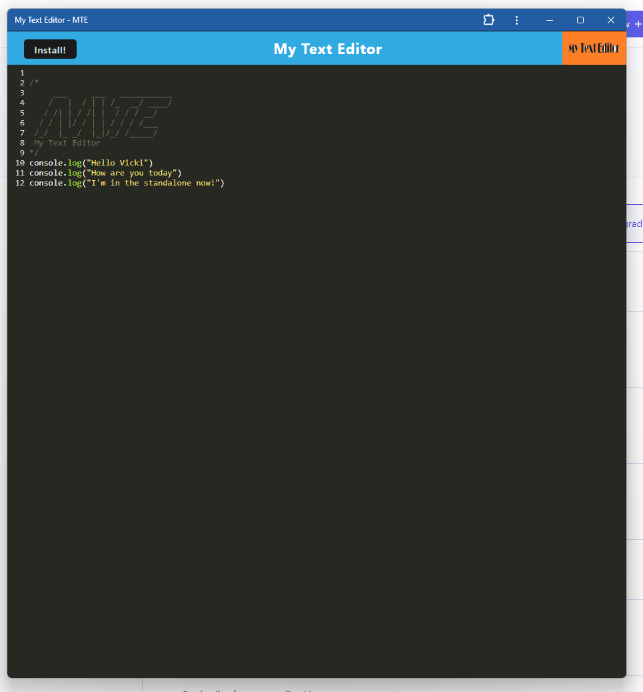

# text-editor

## Description
This is a text-editor that runs in a browser. It is a single-page application meeting the PWA criteria. It will feature a number of data persistence techniques that serve as redundancy in case one of the options is not supported by the browser. It functions offline.

# User Story
AS A developer

I WANT to create notes or code snippets with or without an internet connection

SO THAT I can reliably retrieve them for later use

# Acceptance Criteria
GIVEN a text editor web application

WHEN I open my application in my editor

THEN I should see a client server folder structure

WHEN I run `npm run start` from the root directory

THEN I find that my application should start up the backend and serve the client

WHEN I run the text editor application from my terminal

THEN I find that my JavaScript files have been bundled using webpack

WHEN I run my webpack plugins

THEN I find that I have a generated HTML file, service worker, and a manifest file

WHEN I use next-gen JavaScript in my application

THEN I find that the text editor still functions in the browser without errors

WHEN I open the text editor

THEN I find that IndexedDB has immediately created a database storage

WHEN I enter content and subsequently click off of the DOM window

THEN I find that the content in the text editor has been saved with IndexedDB

WHEN I reopen the text editor after closing it

THEN I find that the content in the text editor has been retrieved from our IndexedDB

WHEN I click on the Install button

THEN I download my web application as an icon on my desktop

WHEN I load my web application

THEN I should have a registered service worker using workbox

WHEN I register a service worker

THEN I should have my static assets pre cached upon loading along with subsequent pages and static assets

WHEN I deploy to Render

THEN I should have proper build scripts for a webpack application

### Mock-Up
The text-editor app was deployed to Render which hosts full-stack applications. See Installation-Execution for details.

Main page on start up:

Manifest:

Service Worker:

IDB:

Installed look:

## Installation-Execution
Execute text-editor by running this link in your browser:
https://text-editor-48tx.onrender.com

When you first run, you will see the text editor with MTE displayed. Click on the Install button to run this text-editor without the internet. It will appear without the browser information on the top.

In Dev Tools you will see:

1. Under Application/Manifest: the text-editor shows with its Identity, Presentation and Icons information.

2. Under Application/Service Workers: you will see the service worker information about the deployed version (deployed in Render).

3. Application/IndexedDB: this is the IDB that the app is using. Under the name MTE will be the data that has been stored in its IDB. As you enter more information into the text-editor, you will see it added to the IDB.

## Usage
The text-editor app allows a user to save notes or examples of code or any text data that you would like to save, to be retrieved at a later time. The user will be able to save their desired information with or without an internet connection. They won't "lose their thoughts" when the internet is down or inaccessible.

## Testing
N/A

## Credits
N/A

## License
N/A